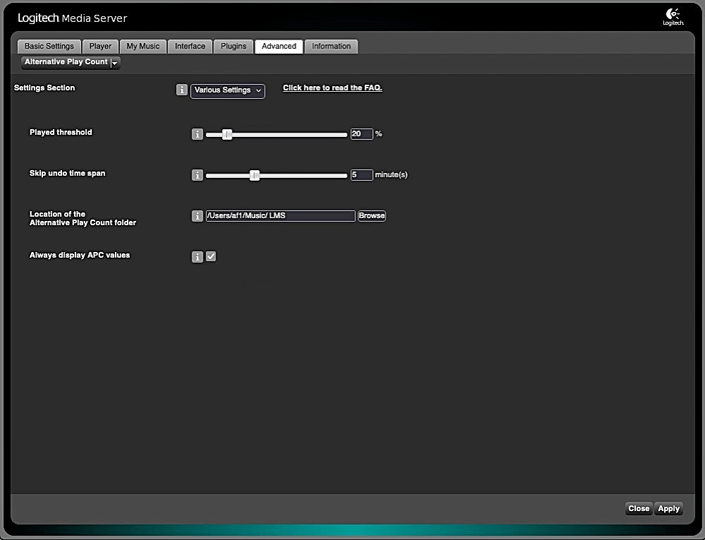

Alternative Play Count
====

**Alternative Play Count**[^1] provides *alternative* **play count**s and **skip count**s that aim to reflect your true listening history.  
If you *skip* tracks in a playlist, LMS still increases their *play* counts. With **Alternative Play Count** you set a time *after* which a song counts as **played**. If you skip the song **before**, it counts as **skipped**, **not played**.  
💡 Even though you can use APC data with any plugin and in any SQLite query, the ***Alternative Play Count* plugin was designed with [Dynamic Playlists](https://github.com/AF-1/lms-dynamicplaylists) and [Visual Statistics](https://github.com/AF-1/lms-visualstatistics) in mind**.  
As LMS and APC play counts diverge in the long term, you will benefit from the more accurate quality of the data (e.g. in DPL mixes & VS charts).
  
[⬅️ **Back to the list of all plugins**](https://github.com/AF-1/)
  

## Requirements

- LMS version >= 7.**9**
- LMS database = **SQLite**
   

## Screenshots

   

## Features
- Set a time[^2] *after* which a song counts as **played**. If you skip the song **before**, it counts as **skipped**, **not played**.
- The **dynamic played/skipped value** (DPSV) reflects your **listening history/decisions of the *recent past*** and is independent of the absolute play count and skip count values. A track's DPSV increases if played and decreases if skipped (see FAQ for details). You can use it to create dynamic playlists with [Dynamic Playlist Creator](https://github.com/AF-1/lms-dynamicplaylistcreator) for [Dynamic Playlists](https://github.com/AF-1/lms-dynamicplaylists) or filter rules in [Custom Skip](https://github.com/AF-1/lms-customskip#custom-skip).
- *Separate database table* for APC values (play count, date last played, skip count, date last skipped, dynamic played/skipped value)
- *Create* (scheduled) **backups** of your APC data and *restore* values from backup files.
- Automatically undo a track's last (accidental) skip count increment if the track is played within a certain time span afterwards (see plugin settings).
- **Reset** *play count*, *skip count* or *dynamic played/skipped value* (DPSV) for **individual** or **all** tracks (see FAQ).
- Use APC data with plugins like [**Dynamic Playlists**](https://github.com/AF-1/lms-dynamicplaylists#dynamic-playlists) or [**Visual Statistics**](https://github.com/AF-1/lms-visualstatistics#visual-statistics).
- Includes skip/filter rules for [**Custom Skip**](https://github.com/AF-1/lms-customskip#custom-skip).
   

[^2]: i.e. percentage of the total song duration

## Installation

You should be able to install **Alternative Play Count** from the LMS main repository (LMS plugin library): **LMS > Settings > Plugins**. 

If you want to test a new patch that hasn't made it into a release version yet or you need to install a previous version you'll have to [install the plugin manually](https://github.com/AF-1/sobras/wiki/Manual-installation-of-LMS-plugins).

It usually takes a few hours for a *new* release to be listed on the LMS plugin page.
  

### Initial values to start with
The plugin will use the current LMS play counts as a starting point. 
If you want to start from scratch (no play counts) or use only higher LMS play count values to start your APC database, then you should change this in the APC settings right after installation. 
APC play count and skip count values are used <i>once</i> to populate the DPSV column of the APC database when you <i>first</i> install version 1.2 or higher. These are just initial values which you can <i>reset</i> at any time on this page: <i>LMS Settings</i> > <i>Advanced</i> > <i>Alternative Play Count</i> > <i>Reset</i>.
   

## Reporting a new issue

If you want to report a new issue, please fill out this [**issue report template**](https://github.com/AF-1/lms-alternativeplaycount/issues/new?template=bug_report.md&title=%5BISSUE%5D+).
   

## FAQ

»<b>What's a <i>dynamic played/skipped</i> value? How does it work?</b>«
 

The <b>dynamic played/skipped value (DPSV)</b> is supposed to reflect your <i>recent</i> listening habits/decisions and <b>range</b>s between <b>-100</b> (skipped very often recently) and <b>100</b> (played very often recently). When a track has been played long enough to count as played, the DPSV increases, just as it decreases if the track is skipped. The closer the current DPSV is to the middle of the scale (0), the greater the increase/decrease. Conversely, DPSV close to 100 or -100, i.e. tracks that have been played or skipped very often recently, change less and will therefore have to be played or skipped more often to move away from the end of the scale. Also, skipping a track decreases its DPSV twice as much as playing it increases it (this is hard-coded and not a user setting).  
<i>Example:</i> You've been listening to a great track (rated 5 stars) too many times and you started skipping it when it came up in a mix. It's still a great track, therefore the rating shouldn't change. If you create a dynamic playlist or a CustomSkip filter that exclude tracks with a DPSV of -80 or lower, eventually this track will no longer be played, either skipped by CustomSkip or filtered out in a dynamic playlist - without changing its rating. A quick way to get the track back into the mix would be to reset the track's DPSV to zero by clicking on the DPSV value in the track's context menu.

 

»<b>Can I <i>reset</i> <i>play count</i>, <i>skip count</i> or <i>DPSV</i> for individual or all tracks?</b>«
 

You can <b>reset play counts</b>, <b>skip counts</b> or <b>DPSV</b> for <b>individual</b> tracks by clicking on the corresponding item in a track's context menu (AKA song details page). Some web skins and controllers will list APC values in the >b>More info</b> submenu. 
If you want to reset *all* skip counts, DPSV or the *complete* database, you can do so on this page: <i>LMS Settings</i> > <i>Advanced</i> > <i>Alternative Play Count</i> > <i>Reset</i>.

 
   

[^1]: If you want localized strings in your language, please read <a href="https://github.com/AF-1/sobras/wiki/Adding-localization-to-LMS-plugins"><b>this</b></a>.
